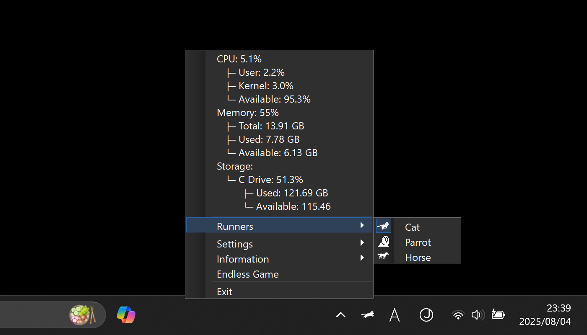
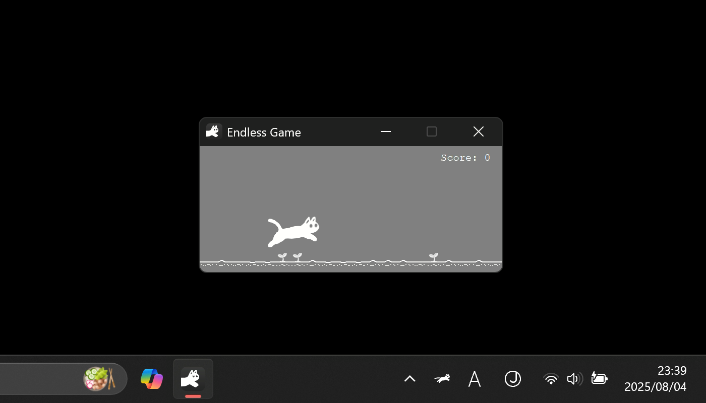

# RunCat 365

**A cute running cat animation on your Windows Taskbar.**

> [!CAUTION]
>
> - This project is for Windows, so we do not accept inquiries about macOS version.
> - We do not accept issues or pull requests in languages other than English.
> - Issues that do not follow the Issue Template will be closed without question.

`C#` `Win32` `.NET 9.0` `Visual Studio` `RunCat`

## Demo

 

 

## Installation

RunCat 365 is available for installation on the Microsoft Store.

- Requirement: Windows 10 version 19041.0 or higher
- Microsoft Store: https://apps.microsoft.com/detail/9nw5lpnvwfwj
- Language: English, Japanese, Spanish

## Contributors

